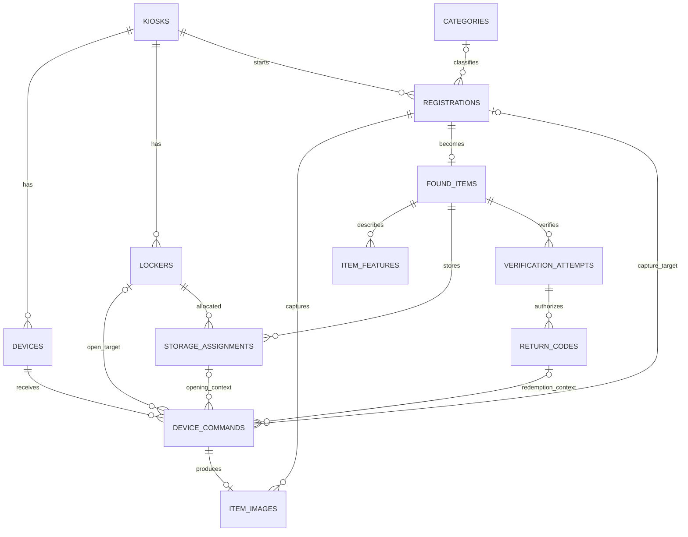

# 백엔드 ERD 명세

상태: 검토용 논리 설계 · 2026-10-08

현재 업무 ORM 모델·마이그레이션·확정 ERD는 없다. 사용자는 등록·사진·물건·보관 이력·반환 코드·명령을 검토용 테이블로 제안하도록 요청했다. 따라서 **아래 테이블명·컬럼명·타입·NULL·인덱스·상태값은 모두 설계 제안**이다. 근거가 있는 업무 관계와 사용자 결정은 별도로 표시한다. SQL DDL이나 Alembic 마이그레이션으로 확정하지 않는다.

근거 문서는 [S1~S8](README.md), 질문·결정은 [검토 기록](spec-review.md), 처리 흐름은 [기능 명세](functional-spec.md)를 따른다.

## 1. 업무상 요구와 설계 경계

| 구분 | 요구 또는 결정 | 근거 |
| --- | --- | --- |
| 원문 요구 | 키오스크에는 촬영 Pi와 보관함 Pi가 있고 시제품의 보관함은 2칸 | S2 1절, S3 |
| 원문 요구 | 물건과 보관함 번호의 연결은 백엔드가 관리 | S2 1절 |
| 원문 요구 | 하나의 등록 ID에 순서가 있는 사진 2장, 촬영마다 다른 명령 ID | S2 3.1·6.1, S4 |
| 원문 요구 | 사전 정의한 1차 카테고리와 습득자가 입력하는 2차 특징 | S1 기능 세부 사항 |
| 원문 요구 | 개방 성공 응답 후에만 번호 반환·반환 코드 사용 처리 | S2 6절 |
| 사용자 결정 | 등록 사진의 이미지 분석 성공 후에만 등록용 보관함 개방 허용 | D04 |
| 사용자 결정 | 완료 버튼 후 백엔드가 문 상태를 조회하는 안 사용 | D03 |
| 사용자 결정 | 사용자 완료 확인과 `closed`를 함께 만족하면 업무 완료로 간주 | D06 |
| 사용자 결정 | 원본 사진은 비공개 S3, DB에는 객체 키·메타데이터 저장 | D07 |
| 사용자 결정 | 본인인증은 미정. 관련 DB·API 확정 보류 | D02 |
| 미정 | 소유 확인용 필수 피처·입출력·판정·코드 발급 조건 | S5, Q05·Q06 |

관계도는 제안된 저장 구조이다. `devices`를 DB에서 관리할지는 Q09에서 결정한다. 장치 주소를 설정 파일로 관리하면 장치 참조 방식을 함께 수정한다. 후속 결정 D08·D09에 따라 AI가 특징 기반 질문 생성·답변 평가를 맡는다. 질문 ID·회차·재생성·보존 계약이 정해지면 검증 시도와 질문·답변의 관계를 추가 검토한다. 현재는 그 전용 테이블과 사용자 계정·관리자 승인 테이블을 확정하지 않는다.

## 2. 개념 관계도

## 3. 관계 해석

- 키오스크당 여러 보관함과 등록 이력이 존재한다. 시제품의 2칸을 전체 DB 행 수 제한으로 만들지 않는다.
- 등록 도중에는 이미지가 0장 또는 1장일 수 있다. 정상 완료할 때 사용하는 사진은 순서가 구분되는 2장이다. 재촬영 이력의 허용 여부는 별도 결정한다.
- 등록 건에서 확정 물건은 최대 1개만 생성한다. 명령 재전송이나 등록 완료 재요청으로 물건이 늘어나지 않게 한다.
- 촬영 명령은 사진을 최대 1장 생성한다. 개방 명령은 사진을 생성하지 않는다. 실패한 촬영은 이미지 행이 없을 수 있다.
- 명령의 등록·보관함 참조는 동작별 조건부 관계이다. 촬영 명령은 등록을, 개방 명령은 보관함을 필수로 참조한다.
- 보관함 하나는 과거에 여러 물건을 보관할 수 있지만, 동시에 유효한 배정은 최대 1개이다. 물건도 동시에 유효한 배정을 최대 1개만 가진다는 제안이다.
- 물건의 현재 키오스크는 유효한 보관 배정→보관함→키오스크로 구한다. 최초 등록 키오스크와 혼동하지 않는다. 이동 기능 자체는 이번 요구에 없다.
- 검증 시도에 반환 코드 0개 이상을 연결하는 그림은 실패·미발급 이력과 향후 재발급을 표현하기 위한 제안이다. 여러 유효 코드를 허용한다는 결정이 아니다.
- 하나의 반환 코드로 발생한 개방 시도와 명령의 관계를 보존한다. 동시 사용 제한·재시도·이력 보존은 Q06·Q10의 결정에 따라 구체화한다.

## 4. 공통 컬럼 규칙 제안

| 항목 | 제안 |
| --- | --- |
| 내부 PK | `id: uuid NOT NULL`. 단, `device_commands.command_id`는 외부 규약을 따르는 text PK |
| 등록 ID | 내부 UUID 사용을 제안하지만 Pi에는 string으로 직렬화. UUID 형식 강제는 팀 API 합의 후 결정 |
| 시각 | `timestamptz`. API 표기는 시간대가 포함된 ISO 8601. 예시 시각·명령 TTL을 고정값으로 옮기지 않음 |
| 생성 이력 | 각 테이블에 `created_at: timestamptz NOT NULL` 제안. 변경 가능한 업무 엔티티에 `updated_at` 추가 검토 |
| 상태 | 초기에는 text와 검증 제약을 제안. 아래 상태 어휘와 전이는 승인 후 확정 |
| 삭제 | 업무 관계의 무조건 CASCADE 삭제를 전제하지 않음. 개인정보·사진·명령·코드의 보존 기간 결정 후 FK 삭제 정책 확정 |
| 조건부 NULL | 표의 조건에 따라 허용. NULL을 실패·거절·완료의 대체 표현으로 사용하지 않음 |

아래 표에서는 공통 PK·생성 시각을 생략한다. `필수`는 이 제안 내의 NOT NULL이며 승인된 요구사항이라는 뜻이 아니다.

## 5. 테이블별 정의 제안

### 5.1 kiosks

키오스크 위치 조회와 현장 장치 구분을 위한 엔티티(S1, S2).

| 컬럼 | 타입 | NULL 정책·의미 |
| --- | --- | --- |
| name | text | 필수, 사용자에게 표시할 식별 이름 |
| location_description | text | 허용, 설치 장소 설명 |
| latitude / longitude | numeric | 함께 존재하거나 함께 NULL. 지도 조회에 필요한 필수 여부·정밀도는 Q08에서 결정 |

좌표 범위 검증과 식별용 코드 추가 여부는 API 입력 계약과 함께 정한다. 운영 시간·거리 계산·GPS 수집 기능은 원문에 없는 추가 요구로 두지 않는다.

### 5.2 devices

장치 DB 관리 선택 시 사용하는 후보(S2 7절).

| 컬럼 | 타입 | NULL 정책·의미 |
| --- | --- | --- |
| kiosk_id | uuid FK → kiosks | 필수 |
| role | text | 필수, `capture` 또는 `locker` |
| base_url | text | 필수, Tailscale 장치 API 주소 |

초기 `UNIQUE(kiosk_id, role)` 제안. 장치 교체·퇴역 이력이 필요해지면 별도로 수정한다. 비밀 API 키의 DB 평문 저장은 제안하지 않으며 키 저장·회전 수단은 미정이다. `/health` 응답의 역할이 등록된 역할과 일치하는지 확인한다.

### 5.3 lockers

| 컬럼 | 타입 | NULL 정책·의미 |
| --- | --- | --- |
| kiosk_id | uuid FK → kiosks | 필수 |
| locker_number | integer | 필수, 해당 키오스크/Pi에서 사용하는 양의 칸 번호 |

`UNIQUE(kiosk_id, locker_number)` 제안. Pi API의 `{locker_id}` 예시는 정수 2이지만 그 번호의 범위는 명시되지 않았다. **내부 UUID를 Pi 경로에 그대로 넣지 않는다.** Q09에서 Pi에 전달할 번호와 장치별 유일성을 합의한다. 빈 칸 여부는 유효한 배정으로 판단하며 문이 닫혀 있다는 이유로 빈 칸이라 판단하지 않는다.

### 5.4 categories

사전 정의된 1차 카테고리 후보(S1).

| 컬럼 | 타입 | NULL 정책·의미 |
| --- | --- | --- |
| code | text UNIQUE | 필수, API에서 사용할 식별 코드 제안 |
| name | text | 필수, 물건 종류 표시명 |

목록·코드·운영 중 변경 방법은 Q08에서 결정한다. 2차 카테고리는 자유 입력 특징이므로 이 테이블에 부모·자식 계층을 임의로 추가하지 않는다.

### 5.5 registrations

첫 촬영부터 등록 확정까지 묶는 엔티티(S2 3.1·6.1).

| 컬럼 | 타입 | NULL 정책·의미 |
| --- | --- | --- |
| kiosk_id | uuid FK → kiosks | 필수 |
| primary_category_id | uuid FK → categories | 임시 등록 중 허용. 최종 필수 여부·사용자/AI 결정 우선순위는 Q08 |
| secondary_description | text | 허용, 습득자가 입력한 2차 특징. 입력 형식은 Q08 |
| status | text | 필수, 촬영·분석·등록 진행 상태 |
| analysis_status | text | 필수, `pending / running / succeeded / failed` 제안 |
| analysis_input_image_ids | jsonb | 분석 전 NULL. 성공 분석에 사용한 이미지 ID 목록의 스냅샷 제안 |

분석 입력 사진과 완료 시 사용할 사진 두 장이 일치해야 한다(D04). JSON 내부 ID는 FK로 보호되지 않으므로 서비스 검증 또는 별도 분석 실행·입력 연결 테이블이 필요하다. AI 계약 확정 시 최종 저장 방식을 정한다. `succeeded`의 의미도 Q04에서 결정한다. 본인인증용 사용자 FK·실명·전화번호는 미정이므로 추가하지 않는다.

### 5.6 item_images

| 컬럼 | 타입 | NULL 정책·의미 |
| --- | --- | --- |
| registration_id | uuid FK → registrations | 필수 |
| capture_command_id | text FK → device_commands.command_id, UNIQUE | 필수, 사진을 만든 촬영 명령 |
| shot_order | smallint | 필수, 최초 흐름의 1 또는 2 |
| object_key | text | S3 저장 완료 전 NULL, 완료 시 필수. 비공개 S3 객체 키(D07) |
| content_type | text | 필수, 현재 규약 `image/jpeg` |
| byte_size | bigint | 수신 전 NULL, 완료 시 양수 |
| received_at | timestamptz | 수신 전 NULL. 백엔드 수신 시각 |
| storage_status | text | 필수, `pending / ready / failed` 제안 |

최초 제안은 `UNIQUE(registration_id, shot_order)`이며 재촬영 이력은 아직 설계에 포함하지 않는다. 재촬영을 채택하면 이미지 버전·현재 채택 사진과 고유 제약을 함께 재검토한다(Q07). 같은 촬영 명령의 재전송으로 이미지 행이 늘어나면 안 된다.

버킷을 설정으로 하나만 관리할지 DB에 함께 저장할지, 미리보기 접근 방식·객체 정리·보존 기간은 미정이다. 만료되는 서명 URL을 영구 객체 식별자로 저장하지 않는 안을 제안한다. S3 업로드와 DB 갱신의 부분 실패를 처리한 뒤에만 `ready`로 표시한다.

현재 JPEG 응답에는 촬영 시각 메타데이터가 명시되어 있지 않다. `received_at`을 실제 촬영 시각으로 표기하거나 JSON의 `captured_at`을 요구하지 않는다. 이미지의 명령과 등록 ID 일치는 별도 관계 검증이 필요하다.

### 5.7 found_items

| 컬럼 | 타입 | NULL 정책·의미 |
| --- | --- | --- |
| registration_id | uuid FK → registrations, UNIQUE | 필수, 출처 등록 |
| status | text | 필수, `awaiting_deposit / stored / awaiting_pickup / returned` 제안 |

이미지 두 장과 분석이 준비된 등록 완료 요청에서 물건을 만들고 `awaiting_deposit`로 두는 안이다. 이 행의 생성이 실제 투입 완료를 뜻하지 않는다. 실패·취소된 배정과 물건의 정리 정책은 Q03에서 결정한다. 등록 정보는 위 등록 FK로 참조하며 동일 카테고리를 양쪽에 독립 수정하는 중복 필드는 제안하지 않는다.

### 5.8 storage_assignments

현재 점유와 과거 보관 이력을 분리하기 위한 제안이다. 원문이 이 테이블 이름·이력 보존 기간까지 정한 것은 아니다.

| 컬럼 | 타입 | NULL 정책·의미 |
| --- | --- | --- |
| found_item_id | uuid FK → found_items | 필수 |
| locker_id | uuid FK → lockers | 필수 |
| status | text | 필수, `reserved / awaiting_deposit / stored / awaiting_pickup / completed / cancelled` 제안 |
| deposited_at | timestamptz | 투입 완료 확인 전 NULL |
| retrieved_at | timestamptz | 수령 완료 확인 전 NULL |
| ended_at | timestamptz | 유효 배정 중 NULL. 완료·취소로 해제된 시점 |

`ended_at IS NULL`인 행에 대해 `locker_id`, `found_item_id` 각각 부분 UNIQUE 인덱스를 제안한다. 예약·개방 중·결과 불명·수령 대기에서도 배정을 유지한다. `completed/cancelled`와 `ended_at`의 일치 제약, `retrieved_at >= deposited_at` 등 시각 검증은 상태 계약과 함께 확정한다. 개방 성공만으로 배정을 종료하지 않는다.

### 5.9 item_features

AI 연계 형식이 미정이므로 다음 최소 후보만 둔다(S5).

| 컬럼 | 타입 | NULL 정책·의미 |
| --- | --- | --- |
| found_item_id | uuid FK → found_items | 필수 |
| source | text | 필수, 사용자 입력·이미지 분석 등 정보 출처 |
| payload | jsonb | 필수 제안이나 내부 구조는 미정. 구조 없는 AI 원문을 그대로 검색 계약으로 사용하지 않음 |

어떤 필드가 공개·비공개인지, 사진별/통합 분석을 어떻게 표현할지, 점수·모델 버전·분석 이력을 보존할지 확정 전이다. 등록 단계 분석 결과의 저장 구조도 Q04에서 함께 정한다. 색상·브랜드·흠집을 필수 컬럼으로 고정하지 않는다.

### 5.10 verification_attempts

| 컬럼 | 타입 | NULL 정책·의미 |
| --- | --- | --- |
| found_item_id | uuid FK → found_items | 필수 |
| status | text | 필수 제안, 실제 값·판정 의미는 Q05에서 결정 |

대상과 시도 이력을 연결하기 위한 틀이다. D08·D09에 따라 AI가 생성한 질문과 사용자 답변·AI 평가 결과를 이 시도에 연결해야 한다. 질문 ID·버전·회차와 저장·보존 계약은 Q05에서 정하고 컬럼 또는 자식 테이블을 추가한다. 유사도·합격 점수·승인자 컬럼은 임의로 넣지 않는다. 이 ERD는 질문·답변의 물리 구조 확정 전 제안이다.

### 5.11 return_codes

| 컬럼 | 타입 | NULL 정책·의미 |
| --- | --- | --- |
| verification_attempt_id | uuid FK → verification_attempts | 필수 제안, 코드 발급 근거. 승인 조건 미정 |
| token_digest | text UNIQUE | 필수 제안, 코드 검증용 보호 값. 생성·보호 방식 미정 |
| status | text | 필수, `issued / processing / used / expired / revoked` 제안 |
| expires_at | timestamptz | 유효기간 정책 확정 후 NULL 여부 결정 |
| used_at | timestamptz | 개방 성공 확인 전 NULL |

물건은 검증 시도 FK로 구한다. 코드에 별도 물건 FK를 중복 저장해 검증 대상과 불일치하는 구조는 피한다. 코드 원문을 저장하지 않는 방안을 제안하되 짧은 코드의 생성·보호·시도 제한을 함께 설계한다. QR·OTP·숫자 길이·TTL은 정하지 않는다.

### 5.12 device_commands

| 컬럼 | 타입 | NULL 정책·의미 |
| --- | --- | --- |
| command_id | text PK | 필수, 백엔드 발급. S2의 string 규약 |
| device_id | uuid FK → devices | 필수 제안. DB 장치 관리 선택 전제 |
| action | text | 필수, `capture / open` 제안 |
| registration_id | uuid FK → registrations | 촬영 시 필수, 개방 시 NULL 제안 |
| locker_id | uuid FK → lockers | 개방 시 필수, 촬영 시 NULL |
| storage_assignment_id | uuid FK → storage_assignments | 업무 개방 시 필수 제안, 촬영 시 NULL |
| return_code_id | uuid FK → return_codes | 수령 개방 시 필수, 등록 개방·촬영 시 NULL |
| expires_at | timestamptz | 필수 |
| status | text | 필수, `created / sent / succeeded / failed / unknown` 제안 |
| result_code / error_code | text | 결과를 알기 전 NULL. 결과 종류에 따라 기록 |

GET 상태 조회에 명령 ID가 필요하다는 요구는 없으므로 이를 하드웨어 실행 명령 행으로 반드시 저장하지 않는다. 별도 진단 기록 필요성은 운영 설계에서 정한다. 사진 바이트나 반환 코드 원문을 명령 결과에 중복 저장하지 않는다.

## 6. 관계 무결성과 상태 전이 제안

1. 촬영 명령의 장치·등록이 같은 키오스크인지, 장치 역할이 capture인지 확인한다. 개방은 locker 역할·해당 키오스크의 보관함만 허용한다.
2. 이미지의 등록과 원본 촬영 명령의 등록이 같아야 한다. 단순 FK 두 개만으로 이 교차 조건이 보장되지는 않는다.
3. 개방 명령의 배정·보관함이 일치해야 한다. 수령 명령은 코드→검증→물건과 배정의 물건까지 일치해야 한다.
4. 정상 등록 완료 조건은 준비된 사진 2장과 그 사진에 대한 분석 성공이다(D04). 촬영·분석 실패는 개방을 허용하는 성공 상태로 바꾸지 않는다.
5. 빈 보관함 배정은 DB의 원자적 처리와 고유 제약으로 직렬화한다. 동시에 반환 코드를 처리하는 요청도 중복 개방을 만들지 않게 한다.
6. DB 트랜잭션과 물리 개방·외부 이미지 저장은 하나의 원자적 작업이 아니다. 명령 기록→외부 호출→결과 기록 사이의 장애 복구 정책을 Q10에서 정한다.
7. `opened` 확인 후 코드 사용 처리와 명령 성공을 기록한다. 수령 완료는 별도의 완료 확인 뒤 배정을 종료한다. 결과 불명일 때 배정이나 코드 처리 잠금을 무조건 해제하지 않는 방안을 제안한다.
8. 물건·배정 양쪽의 상태를 저장한다면 같은 트랜잭션에서 전이시킨다. 상태 중복을 없애고 배정에서 파생하는 대안도 구현 전에 검토한다.

| 업무 구간 | 전이 제안 | 확정 조건 |
| --- | --- | --- |
| 등록 준비 | 촬영 중 → 사진 준비 → 분석 중 → 분석 성공 | 사진 두 장은 S2·S4, 분석 성공 선행은 D04, 실패 재시도 정책은 Q04·Q07 |
| 등록 개방 | 빈 칸 예약 → 개방 중 → 투입 대기 | opened 전 번호 표시 금지는 S2 |
| 투입 완료 | 투입 대기 → 보관 중 | 성공한 개방 이후 사용자 완료 확인 + 센서 closed(D03·D06) |
| 수령 개방 | 코드 발급 → 처리 중 → 개방 성공·코드 사용 | S2 6.2; 결과 불명은 별도 보류 제안 |
| 수령 완료 | 수령 대기 → 반환 완료·배정 종료 | 성공한 개방 이후 사용자 완료 확인 + 센서 closed(D03·D06) |
| 장치 실패 | sent → failed 또는 unknown | 명확한 실패와 응답 유실 구분 제안, Q10 |

부분 UNIQUE·CHECK·복합 FK·서비스 검증 중 어떤 수단으로 각 제약을 보장할지는 물리 ERD 작성 시 결정한다. 새로 제안한 제약을 이미 구현된 보장으로 해석하지 않는다.

## 7. 물리 설계 전 확인 항목

Q03 취소·예약 해제 등 완료 예외, Q04 분석 계약, Q05 소유 확인, Q06 코드 정책, Q07 이미지 저장·재촬영, Q08 카테고리·공개 검색, Q09 장치 식별·인증, Q10 장애 복구, Q11 보존·삭제를 검토한다. 승인된 항목부터 컬럼·인덱스·상태 전이와 마이그레이션을 확정한다.
