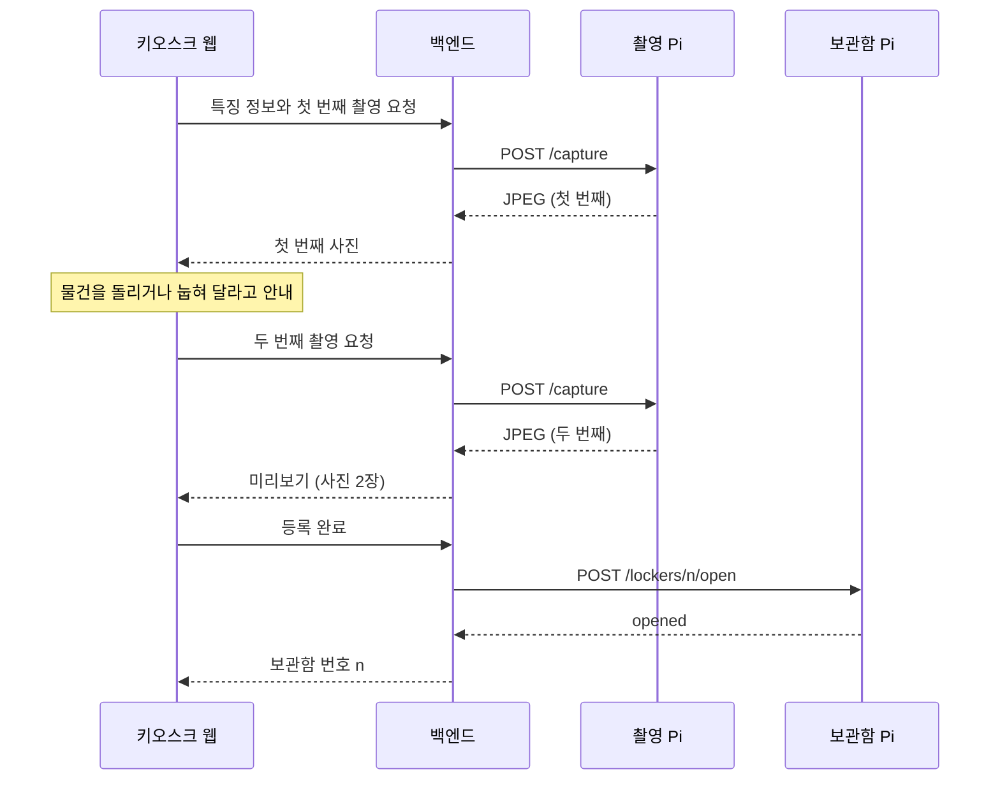
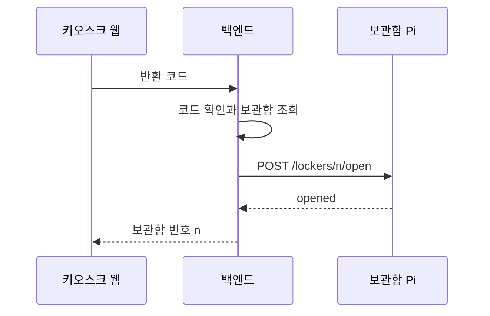

# 백엔드-라즈베리파이 통신 규약 (초안)

백엔드와 라즈베리파이(Pi) 컨트롤러가 주고받는 요청과 응답을 정리한다. 아직 초안이며, 7절의 협의 항목은 정해지는 대로 반영한다.

## 1. 기본 원칙

- 키오스크 한 대에는 Pi가 두 대 있다. 촬영 Pi는 촬영 상자의 카메라 1대를, 보관함 Pi는 보관함의 잠금장치와 문 센서를 맡는다.
- 백엔드가 Tailscale을 통해 각 Pi의 HTTP API를 직접 호출한다. 촬영 명령은 촬영 Pi로, 보관함 명령은 보관함 Pi로 보낸다. Pi는 백엔드를 주기적으로 조회(폴링)하지 않는다.
- 웹은 Pi에 직접 접근하지 않는다.
- Pi는 하드웨어 제어만 맡는다. 어떤 물건이 몇 번 보관함에 있는지는 백엔드가 관리하고, Pi는 "몇 번 보관함을 열어라" 같은 명령만 받는다.
- 모든 명령에는 백엔드가 발급한 `command_id`가 붙는다.

## 2. 공통 사항

두 Pi는 같은 규약을 따른다.

| 항목 | 내용 |
| --- | --- |
| 주소 | 촬영 Pi `http://<촬영 Pi의 Tailscale 이름>:8000`, 보관함 Pi `http://<보관함 Pi의 Tailscale 이름>:8000` (HTTPS 사용 여부는 협의) |
| 인증 | 요청 헤더 `X-API-Key` (협의) |
| 본문 형식 | JSON (촬영 응답만 JPEG) |
| 오류 형식 | `{"detail": {"code": "...", "message": "..."}}` |

명령 요청의 공통 필드:

| 필드 | 타입 | 설명 |
| --- | --- | --- |
| `command_id` | string | 백엔드가 발급한 명령 ID. 같은 ID의 명령은 한 번만 실행한다 |
| `expires_at` | string (ISO 8601) | 명령 만료 시각. 이 시각이 지난 명령은 실행하지 않는다 |

## 3. API

| 메서드·경로 | 담당 | 용도 |
| --- | --- | --- |
| `POST /capture` | 촬영 Pi | 사진 1장 촬영 |
| `POST /lockers/{locker_id}/open` | 보관함 Pi | 보관함 개방 |
| `GET /lockers/{locker_id}` | 보관함 Pi | 문 상태 조회 |
| `GET /health` | 두 Pi 모두 | 동작 확인 |

### 3.1 촬영 `POST /capture` (촬영 Pi)

물건을 정확히 인식하기 위해 등록 한 건에 사진을 2장 찍는다. 촬영 상자의 카메라는 1대이므로, 첫 번째 사진을 찍은 뒤 사용자가 물건을 돌리거나 눕혀 다른 면이 보이게 놓으면 두 번째 사진을 찍는다. 촬영 명령 한 번에 사진 한 장을 찍으므로, 백엔드는 같은 `registration_id`로 촬영 명령을 두 번 보낸다(`command_id`는 매번 다르다).

요청:

```json
{
  "command_id": "cmd-0001",
  "registration_id": "reg-0001",
  "expires_at": "2026-10-07T13:00:30+09:00"
}
```

응답 `200`: JPEG 이미지 (`Content-Type: image/jpeg`)

두 촬영 사이에 물건의 위치와 높이가 바뀌므로, Pi는 촬영할 때마다 초점을 다시 맞춘 뒤 찍는다.

### 3.2 보관함 개방 `POST /lockers/{locker_id}/open` (보관함 Pi)

요청:

```json
{
  "command_id": "cmd-0002",
  "expires_at": "2026-10-07T13:01:00+09:00"
}
```

응답 `200`:

```json
{ "locker_id": 2, "result": "opened" }
```

잠금장치를 푼 뒤 바로 응답한다. 문이 닫힐 때까지 기다리지 않는다.

### 3.3 문 상태 조회 `GET /lockers/{locker_id}` (보관함 Pi)

응답 `200`:

```json
{ "locker_id": 2, "door": "closed" }
```

`door`는 `open` 또는 `closed`이다.

### 3.4 동작 확인 `GET /health` (두 Pi 모두)

응답 `200`:

```json
{ "status": "ok", "role": "capture" }
```

`role`은 `capture`(촬영 Pi) 또는 `locker`(보관함 Pi)이다. 백엔드는 이 값으로 주소가 맞는 Pi를 가리키는지 확인할 수 있다.

## 4. 오류

| 상태 코드 | code | 상황 |
| --- | --- | --- |
| 400 | `COMMAND_EXPIRED` | 만료된 명령 |
| 400 | `INVALID_COMMAND` | 필수 값 누락 등 잘못된 요청 |
| 401 | `UNAUTHORIZED` | 인증 실패 |
| 404 | `LOCKER_NOT_FOUND` | 없는 보관함 번호 |
| 409 | `DEVICE_BUSY` | 다른 명령 실행 중 |
| 500 | `CAMERA_ERROR` | 카메라 오류 |
| 500 | `LOCK_ERROR` | 잠금장치 오류 |

담당이 아닌 Pi에 요청하면(예: 보관함 Pi에 `POST /capture`) 404가 돌아온다.

## 5. 중복 명령

같은 `command_id`가 다시 오면 다시 실행하지 않고 처음 결과를 그대로 돌려준다. 백엔드가 응답을 못 받아 같은 명령을 다시 보내도 보관함이 두 번 열리지 않게 하기 위해서다.

## 6. 흐름

### 6.1 등록 (습득자)



두 사진은 같은 등록 건(`registration_id`)에 순서대로 연결된다. 두 번째 촬영은 사용자가 물건 방향을 바꾸고 버튼을 누를 때 요청한다. 보관함은 '등록 완료' 뒤에 연다. 백엔드는 개방 성공 응답을 받은 뒤에만 웹에 번호를 돌려준다. 그래서 번호가 화면에 뜰 때는 보관함이 이미 열려 있다.

### 6.2 수령 (분실자)



반환 코드는 개방 성공 응답을 받은 뒤에 사용 처리한다. 개방에 실패하면 코드를 그대로 두어 다시 시도할 수 있게 한다.

## 7. 협의 항목

- 키오스크별 두 Pi의 주소 관리 방법: 백엔드 설정 파일 / DB
- 문이 닫힌 것을 백엔드가 아는 방법: 보관함 Pi가 백엔드에 알림 / 화면의 '닫았어요' 버튼 후 문 상태 조회
- 인증 방식, API 키를 Pi마다 따로 둘지, 명령 만료 시간
- 사진 해상도와 화질 (AI ① 담당과 함께)
- 촬영·개방 응답 대기 시간, 시간 초과 시 재시도 여부
- Tailscale 계정 관리, HTTPS 사용 여부
- 다시 찍기 허용 여부(두 장 중 한 장만 다시 찍기 포함), 임시 등록 유지 시간
