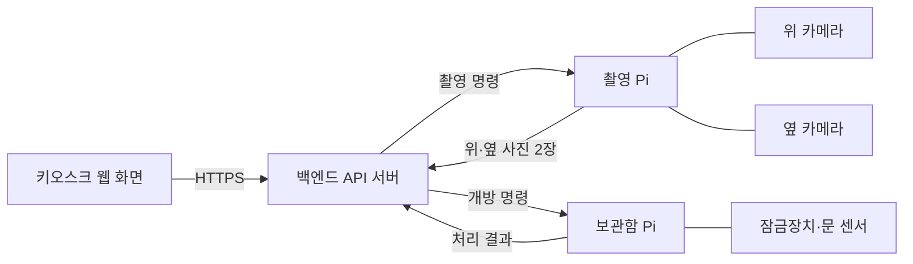

# smart-lost-found Raspberry Pi

키오스크 현장의 하드웨어를 제어하는 라즈베리파이 파트. 라즈베리파이 두 대를 쓴다. 촬영 Pi는 촬영 상자의 카메라 2대(위·옆)와 키오스크 화면을, 보관함 Pi는 보관함의 잠금장치와 문 센서를 맡는다. 두 Pi 모두 백엔드의 명령을 받아 하드웨어를 움직이고, 결과를 백엔드에 돌려준다.

현재는 설계 단계이다. 백엔드와 주고받는 요청·응답 초안은 [docs/device-protocol.md](../docs/device-protocol.md)에 정리했다.

## 구성

| Pi | 연결 장치 | 하는 일 |
| --- | --- | --- |
| 촬영 Pi | 카메라 2대(위·옆), 모니터, 키보드, 마우스 | 분실물 위·옆 촬영, 키오스크 웹 화면 실행 |
| 보관함 Pi | 보관함 잠금장치 2개, 문 센서 2개 | 보관함 개방, 문 상태 확인 |

카메라를 2대 쓰는 이유: 물건을 위에서 내려다본 사진과 옆에서 본 사진을 함께 찍어야 모양·크기·특징을 더 정확히 인식하고 판별할 수 있다.

Pi를 두 대로 나눈 이유: 촬영 Pi에는 카메라 2대와 모니터·키보드·마우스가 연결되어 USB 포트가 거의 남지 않고, 촬영 상자와 보관함의 위치에 따라 한 대로는 배선이 어려울 수 있다. 두 Pi는 같은 프로그램을 쓰고 설정으로 역할을 나눈다.

## 시스템에서의 위치



백엔드와 두 Pi는 Tailscale로 연결된다. 키오스크 웹 화면은 촬영 Pi에 연결한 모니터에 띄우지만, 화면은 Pi의 API를 직접 부르지 않고 백엔드하고만 통신한다. Pi도 백엔드를 주기적으로 조회하지 않는다.

## 하드웨어 구성 (시제품)

- 촬영 상자 1개: 분실물을 넣고 키오스크 화면의 '촬영' 버튼을 누르면 위·옆 카메라가 한 장씩 촬영
- 보관함 2개: 칸마다 잠금장치와 문 센서
- 모니터·키보드·마우스: 키오스크 화면 표시와 입력 (터치 화면이 아니다)

부품과 배선은 확정되는 대로 `hardware/`에 정리한다.

## 폴더 구성 (예정)

```text
raspberry-pi/
├── app/        Pi 컨트롤러 (FastAPI, 설정으로 촬영/보관함 역할 선택)
├── tests/      테스트
├── deploy/     자동 실행 서비스, 키오스크 브라우저, Tailscale 설정
├── hardware/   부품 목록, 배선도, 3D 모델
├── docs/       설계 결정, 실험, 문제 해결 기록
└── media/      사진, 시연 영상
```

## 진행 현황

- [x] 시스템 설계 개요와 통신 구조 검토
- [x] Pi 2대 구성 결정 (촬영 Pi, 보관함 Pi)
- [x] 촬영 방식 결정 (위·옆 카메라 2대)
- [x] 백엔드-Pi 통신 규약 초안 작성
- [ ] 통신 규약 확정 (백엔드와 협의)
- [ ] 하드웨어 부품 확정
- [ ] Pi 컨트롤러 구현 (가짜 하드웨어 모드 포함)
- [ ] 실물 하드웨어 연동
- [ ] 키오스크 화면 자동 실행과 고정 (브라우저 종료·주소 변경 방지)
